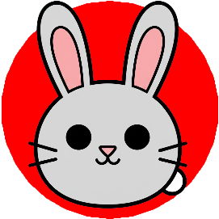
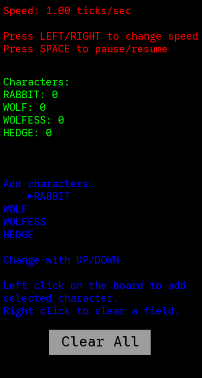

# Wstęp

Wyspa wilków to prosta gra symulacyjna 2D napisana w C++ 17 z użyciem
biblioteki SFML. Celem aplikacji jest symulacja ekologiczna populacji
wilków i królików na wyspie, z uwzględnieniem interakcji
międzygatunkowych, rozmnażania i śmierci.

# Postacie

-   **Królik** &ndash; króliki są ofiarami wilków, posiadają 20% szans na
    rozmnożenie się co każdy krok symulacji, lecz nie potrzebują do tego
    partnera. Ich ruchy są całkowicie losowa, ponadto posiadają 11%
    szans, że nie ruszą się. Nie posiadają one mechanizmu głodu.\
    

        
    

-   **Wilczyca** &ndash; drapieżnik, poluje na króliki - w każdym kroku
    symulacji porusza się w kierunku najbliższego królika, chyba że na
    drodze znajduje się żywopłot lub na planszy nie ma żadnych
    królików - wtedy wykonuje losowy ruch. Wilczyca może rozmnożyć się
    jeśli na tym samym polu znajduje się wilk oraz posiada przynajmniej
    1.0 jednostek tłuszczu. Wilczyca zużywa 0.1 jednostki tłuszczu na
    każdy ruch. Kiedy tłuszcz wyczerpie się wilczyca umiera.\

    

        
    

-   **Wilk** &ndash; działa tak samo jak wilczyca, ale jeśli posiada
    przynajmniej 1.0 jednostek tłuszczu to porusza się w kierunku
    najbliższej wilczycy. Porusza się według priorytetu: wilczyca
    (jeżeli tłuszcz \>= 1.0) $\to$ króliki $\to$ losowy ruch.\

    

        
    

-   **Żywopłot** &ndash; statyczna postać, która blokuje ruch wilków i
    wilczyc. Króliki mogą przez niego przechodzić bez przeszkód.\

    

        
    

# Plansza

Rozmiar planszy wybiera użytkownik przy starcie aplikacji. Plansza jest
reprezentowana jako siatka kwadratów o wymiarach NxN, gdzie N to liczba
wybrana przez użytkownika (minimalnie 2, maksymalnie 30). Każde pole na
planszy może zawierać maksymalnie trzy dowolne postacie (nie licząc
żywopłotów). Plansza jest otoczona ścianami, które blokują ruch
wszystkich postaci.

    

# Interfejs i sterowanie

Na górze bocznego panel wyświetlana jest prędkość symulacji (ilość
kroków na sekundę). Prędkość symulacji można zmieniać za pomocą
przycisków `←` (lewa strzałka) i `→` (prawa strzałka) na klawiaturze.
Użytkownik może w każdej chwili zatrzymać lub wznowić symulację za
pomocą przycisku spacji, co jest wizualizowane przez ikonę pauzy w prawy
górnym rogu planszy. Poniżej znajduje się wybór postaci do umieszczenia
na planszy - użytkownik może zmieniać wybraną postać za pomocą
przycisków `↑` (góra) i `↓` (dół) na klawiaturze a następnie umieszczać
ją na planszy klikając lewym przyciskiem myszy na wybrane pole. Prawy
przycisk myszy usuwa wszystkie postacie z danego pola. Przycisk "Clear
All" pozwala na wyczyszczenie całej planszy. Istotne jest to, że zmiany
na planszy są możliwe tylko wtedy, gdy symulacja jest zatrzymana.

    

# Dokumentacja

Kod źródłowy aplikacji jest podzielony na następujące klasy:

## Game

Klasa zarządzająca główną pętlą gry, obsługująca zdarzenia i renderująca
planszę oraz postacie.\
Publiczne pola:

-   `const unsigned int boardSize` &ndash; rozmiar planszy (NxN).

-   `const unsigned int screenSize` &ndash; rozmiar planszy w pikselach.

-   `float lineThickness` &ndash; grubość linii siatki planszy.

-   `sf::Font fontGoogleSans` &ndash; główna czcionka używana w interfejsie.

-   `sf::Font fontEmoji` &ndash; czcionka używana do wyświetlania emoji.

-   `std::vector<uint8_t> fontGoogleSansBuffer` &ndash; bufor głównej
    czcionki.

-   `std::vector<uint8_t> fontEmojiBuffer` &ndash; bufor czcionki emoji.

-   `sf::RectangleShape clearAllButton` &ndash; przycisk do czyszczenia
    planszy.

Publiczne metody:

-   `static std::vector<uint8_t> loadResource(WORD resourceId, const wchar_t* resourceType)`
    &ndash; metoda ładująca zasoby (obrazy i czcionki). `resourceId` to
    identyfikator zasobu, `resourceType` to kategoria zasobu. Zwraca
    wektor bajtów reprezentujących zasób.

Publiczne pola:

-   `Board board` &ndash; obiekt reprezentujący planszę gry.

-   `const float rabbitBreedChance` &ndash; szansa rozmnożenia się królika.

-   `const float rabbitIdleChance` &ndash; szansa, że królik się nie ruszy.

-   `int speed` &ndash; zmienna kontrolująca prędkość symulacji.

-   `int tick` &ndash; zmienna kontrolujące kiedy następuje następny krok
    symulacji.

-   `float frameDelay` &ndash; odwrócony stosunek pola `speed` do liczby
    klatek na sekundę.

-   `bool paused` &ndash; zmienna określająca, czy symulacja jest zatrzymana.

-   `int characterSelected` &ndash; indeks wybranej postaci do umieszczenia
    na planszy.

-   `sf::Texture backgroundTexture, sf::Texture rabbitTexture, sf::Texture wolfTexture, sf::Texture eatTexture, sf::Texture deathTexture,sf::Texture rabbitBreedTexture, sf::Texture wolfBreedTexture, sf::Texture hedgeTexture`
    &ndash; tekstury używane do renderowania planszy, postaci oraz animacji.

Publiczne metody:

-   `Game(unsigned int boardSize, unsigned int screenSize)` &ndash;
    konstruktor klasy Game, inicjalizujący planszę i ładujący zasoby.
    `boardSize` to rozmiar planszy (NxN), `screenSize` to rozmiar
    planszy w pikselach.

-   `bool loadTextures()` &ndash; metoda ładująca tekstury z zasobów. Zwraca
    true jeśli załadowano poprawnie, w przeciwnym razie false.

-   `void drawGrid(sf::RenderWindow* window)` &ndash; metoda rysująca siatkę
    planszy na podanym oknie SFML. `window` to wskaźnik na okno SFML.

-   `void drawBackground(sf::RenderWindow* window)` &ndash; metoda rysująca
    tło planszy na podanym oknie SFML. `window` to wskaźnik na okno
    SFML.

-   `void drawControls(sf::RenderWindow* window)` &ndash; metoda rysująca
    elementy interfejsu użytkownika na podanym oknie SFML. `window` to
    wskaźnik na okno SFML.

-   `void drawCharacters(sf::RenderWindow* window)` &ndash; metoda rysująca
    postacie na planszy w podanym oknie SFML. `window` to wskaźnik na
    okno SFML.

-   `sf::Text speedText()` &ndash; metoda tworząca i zwracająca obiekt
    `sf::Text` wyświetlający prędkość symulacji.

-   `sf::Text statusText()` &ndash; metoda tworząca i zwracająca obiekt
    `sf::Text` wyświetlający status symulacji (ilość postaci na
    planszy).

-   `sf::Text boardEditText()` &ndash; metoda tworząca i zwracająca obiekt
    `sf::Text` wyświetlający listę postać do umieszczenia na planszy.

-   `sf::Text pauseText()` &ndash; metoda tworząca i zwracająca obiekt
    `sf::Text` wyświetlający ikonę pauzy, gdy symulacja jest zatrzymana.

-   `Position getFieldFromMousePosition(sf::Vector2i mousePos)` &ndash;
    metoda zwracająca pozycję planszy typu `Position` odpowiadającą
    podanym współrzędnym myszy. `mousePos` to współrzędne myszy w oknie
    SFML.

-   `void handleEvents(sf::RenderWindow* window, const std::optional<sf::Event>* e)`
    &ndash; metoda obsługująca zdarzenia SFML, takie jak kliknięcia myszy i
    naciśnięcia klawiszy. `window` to wskaźnik na okno SFML, `e` to
    wskaźnik na zdarzenie SFML (z głównej pętli zbierającej eventy).

## Position

Klasa reprezentująca pozycję na planszy za pomocą współrzędnych x i y.\
Publiczne pola:

-   `int x` &ndash; współrzędna x pozycji na planszy.

-   `int y` &ndash; współrzędna y pozycji na planszy.

## CharacterType

Wyliczenie reprezentujące typy postaci w grze.

-   `RABBIT` &ndash; królik.

-   `WOLF` &ndash; wilk.

-   `WOLFESS` &ndash; wilczyca.

-   `HEDGE` &ndash; żywopłot.

## Board

Klasa reprezentująca planszę gry, zarządzająca siatką pól i postaci na
niej umieszczonych.\
Prywatne pola:

-   `const int MAX_CHARACTERS_PER_FIELD` &ndash; maksymalna liczba postaci na
    jednym polu planszy.

-   `const int fieldNumber` &ndash; liczba pól na planszy w jednej osi (N).

Prywatne metody:

-   `bool checkOutOfBounds(Position pos)` &ndash; metoda sprawdzająca, czy
    podana pozycja jest poza granicami planszy. `pos` to pozycja do
    sprawdzenia. Zwraca true jeśli pozycja jest poza granicami, w
    przeciwnym razie false.

Publiczne pola:

-   `const float breedFatThreshold` &ndash; próg tłuszczu potrzebny do
    rozmnożenia się wilka/wilczycy.

-   `std::vector<GameCharacter*> gameCharacterList` &ndash; lista wszystkich
    postaci na planszy.

-   `std::vector<GameCharacter*> deadCharacters` &ndash; lista postaci, które
    zginęły w bieżącym kroku symulacji.

-   `std::vector<GameCharacter*> newCharacters` &ndash; lista nowo dodanych
    postaci w bieżącym kroku symulacji.

-   `std::vector<Animation*> animationList` &ndash; lista animacji na
    planszy.

Publiczne metody:

-   `Board(int size)` &ndash; konstruktor klasy Board. `size` to rozmiar
    planszy.

-   `int getFieldNumber()` &ndash; metoda zwracająca wartość pola
    `fieldNumber`.

-   `int getCharacterCount(CharacterType type)` &ndash; metoda zliczająca
    liczbę postaci określonego typu na planszy. `type` to typ postaci do
    zliczenia. Zwraca liczbę postaci danego typu na planszy.

-   `void addCharacter(Position pos, CharacterType type)` &ndash; metoda
    dodająca postać określonego typu na podane pole planszy. `pos` to
    pozycja pola, `type` to typ postaci do dodania.

-   `void removeCharacter(GameCharacter* character)` &ndash; metoda usuwająca
    podaną postać z listy postaci na planszy. `character` to wskaźnik na
    postać do usunięcia.

-   `int countCharactersOnField(Position pos)` &ndash; metoda zliczająca
    liczbę postaci na podanym polu planszy. `pos` to pozycja pola do
    sprawdzenia. Zwraca liczbę postaci na polu.

-   `int countCharactersOnField(Position pos, CharacterType type)` &ndash;
    metoda zliczająca liczbę postaci określonego typu na podanym polu
    planszy. `pos` to pozycja pola do sprawdzenia, `type` to typ postaci
    do zliczenia. Zwraca liczbę postaci danego typu na polu.

-   `bool canMove(GameCharacter* character)` &ndash; metoda sprawdzająca, czy
    podana postać ma możliwość ruchu. `character` to wskaźnik na postać
    do sprawdzenia. Zwraca true jeśli postać może się poruszyć, w
    przeciwnym razie false.

-   `bool canMoveTo(Position pos, bool isWolf = false)` &ndash; metoda
    sprawdzająca, czy można się poruszyć na podane pole planszy. `pos`
    to pozycja pola do sprawdzenia, `isWolf` to flaga określająca, czy
    postać jest wilkiem/wilczycą (domyślnie false). Zwraca true jeśli
    można się poruszyć na pole, w przeciwnym razie false.

-   `sf::Vector2i randomMove(GameCharacter* character)` &ndash; metoda
    generująca losowe przesunięcie dla podanej postaci. `character` to
    wskaźnik na postać do wygenerowania ruchu. Zwraca wektor
    przesunięcia w osi x i y.

-   `GameCharacter* getCharacterAt(Position pos)` &ndash; metoda zwracająca
    wskaźnik na pierwszą postać na podanym polu planszy. `pos` to
    pozycja pola. Zwraca wskaźnik na postać lub nullptr jeśli nie
    znaleziono.

-   `GameCharacter* getCharacterAt(Position pos, CharacterType type)` &ndash;
    metoda zwracająca wskaźnik na pierwszą postać określonego typu na
    podanym polu planszy. `pos` to pozycja pola, `type` to typ postaci
    do znalezienia. Zwraca wskaźnik na postać lub nullptr jeśli nie
    znaleziono.

-   `bool canWolfEatAt(Position pos)` &ndash; metoda sprawdzająca, czy
    wilk/wilczyca może zjeść królika na podanym polu planszy. `pos` to
    pozycja pola do sprawdzenia. Zwraca true jeśli wilk/wilczyca może
    zjeść królika, w przeciwnym razie false.

-   `GameCharacter* getClosestCharacter(Position pos, CharacterType type)`
    &ndash; metoda zwracająca wskaźnik na najbliższą postać określonego typu
    względem podanej pozycji. `pos` to pozycja odniesienia, `type` to
    typ postaci do znalezienia. Zwraca wskaźnik na najbliższą postać lub
    nullptr jeśli nie znaleziono.

-   `bool wolfBreedPossible(Position pos)` &ndash; metoda sprawdzająca, czy
    na podanym polu planszy możliwe jest rozmnożenie się wilka/wilczycy.
    `pos` to pozycja pola do sprawdzenia. Zwraca true jeśli rozmnożenie
    jest możliwe, w przeciwnym razie false.

-   `bool rabbitBreedPossible(Position pos)` &ndash; metoda sprawdzająca, czy
    na podanym polu planszy możliwe jest rozmnożenie się królika. `pos`
    to pozycja pola do sprawdzenia. Zwraca true jeśli rozmnożenie jest
    możliwe, w przeciwnym razie false.

-   `void applyDeathsAndBirths()` &ndash; metoda aktualizująca listę postaci
    na planszy, usuwając martwe postacie i dodając nowo narodzone.

-   `void updateAnimations()` &ndash; metoda aktualizująca stan wszystkich
    animacji na planszy i usuwa zakończone animacje.

-   `void drawAnimations(sf::RenderWindow* window, unsigned int screenSize, unsigned int fieldNumber)`
    &ndash; metoda rysująca wszystkie animacje na podanym oknie SFML.
    `window` to wskaźnik na okno SFML, `screenSize` to rozmiar planszy w
    pikselach, `fieldNumber` to ilość pól na planszy w jednej osi (N).

## GameCharacter

Klasa bazowa dla wszystkich postaci w grze, zawierająca wspólne
właściwości i metody.\
Publiczne pola:

-   `Position pos` &ndash; pozycja postaci na planszy.

-   `CharacterType type` &ndash; typ postaci

-   `int slots` &ndash; liczba zajętych slotów na polu planszy przez tę
    postać.

Publiczne metody:

-   `GameCharacter(Position pos)` &ndash; konstruktor klasy. `pos` to pozycja
    postaci na planszy.

-   `virtual void Move(int deltaX, int deltaY)` &ndash; metoda wirtualna do
    poruszania postaci o podane przesunięcie w osi x i y. `deltaX` to
    przesunięcie w osi x, `deltaY` to przesunięcie w osi y.

-   `virtual void Draw(sf::RenderWindow* window, sf::Texture& texture, unsigned int screenSize, unsigned int fieldNumber, int p = 0)`
    &ndash; metoda wirtualna do rysowania postaci na podanym oknie SFML.
    `window` to wskaźnik na okno SFML, `texture` to referencja do
    tekstury postaci, `screenSize` to rozmiar planszy w pikselach,
    `fieldNumber` to ilość pól na planszy w jednej osi (N), `p` to
    parametr określający pozycję postaci na polu.

## Rabbit

Klasa reprezentująca królika, dziedzicząca po klasie GameCharacter.\
Publiczne metody:

-   `Rabbit(Position pos)` &ndash; konstruktor klasy. `pos` to pozycja
    królika na planszy.

-   `static sf::Texture* GetTexture(class Game* game)` &ndash; metoda
    statyczna zwracająca wskaźnik na teksturę królika z klasy Game.
    `game` to wskaźnik na instancję klasy Game.

## Wolf

Klasa reprezentująca wilka lub wilczycę, dziedzicząca po klasie
GameCharacter.\
Publiczne pola:

-   `double fat` &ndash; ilość tłuszczu posiadanego przez wilka/wilczycę.

Publiczne metody:

-   `Wolf(Position pos)` &ndash; konstruktor klasy. `pos` to pozycja
    wilka/wilczycy na planszy.

-   `Wolf(Position pos, CharacterType type)` &ndash; konstruktor klasy. `pos`
    to pozycja wilka/wilczycy na planszy, `type` to typ postaci.

-   `static sf::Texture* GetTexture(class Game* game)` &ndash; metoda
    statyczna zwracająca wskaźnik na teksturę wilka z klasy Game. `game`
    to wskaźnik na instancję klasy Game.

## Hedge

Klasa reprezentująca żywopłot, dziedzicząca po klasie GameCharacter.\
Publiczne metody:

-   `Hedge(Position pos)` &ndash; konstruktor klasy. `pos` to pozycja
    żywopłotu na planszy.

-   `static sf::Texture* GetTexture(class Game* game)` &ndash; metoda
    statyczna zwracająca wskaźnik na teksturę żywopłotu z klasy Game.
    `game` to wskaźnik na instancję klasy Game.

## Animation

Klasa reprezentująca stan animacji na planszy.\
Prywatne pola:

-   `float alpha` &ndash; przezroczystość animacji

-   `float offsetY` &ndash; przesunięcie animacji w osi Y

-   `int lifetime` &ndash; pozostały czas życia animacji w klatkach

-   `const int maxLifetime` &ndash; maksymalny czas życia animacji w klatkach

-   `sf::Texture& texture` &ndash; referencja do tekstury animacji

Publiczne pola:

-   `Position position` &ndash; pozycja animacji na planszy

Publiczne metody:

-   `Animation(Position pos, sf::Texture& texture)` &ndash; konstruktor
    klasy. `pos` to pozycja animacji na planszy, `texture` to referencja
    do tekstury animacji.

-   `void update()` &ndash; metoda aktualizująca stan animacji
    (przezroczystość, przesunięcie, czas życia).

-   `void draw(sf::RenderWindow* window, unsigned int screenSize, unsigned int fieldNumber)`
    &ndash; metoda rysująca animację na podanym oknie SFML. `window` to
    wskaźnik na okno SFML, `screenSize` to rozmiar planszy w pikselach,
    `fieldNumber` to ilość pól na planszy w jednej osi (N).

-   `bool isFinished()` &ndash; metoda sprawdzająca, czy animacja zakończyła
    się. Zwraca true jeśli animacja zakończyła się, w przeciwnym razie
    false.